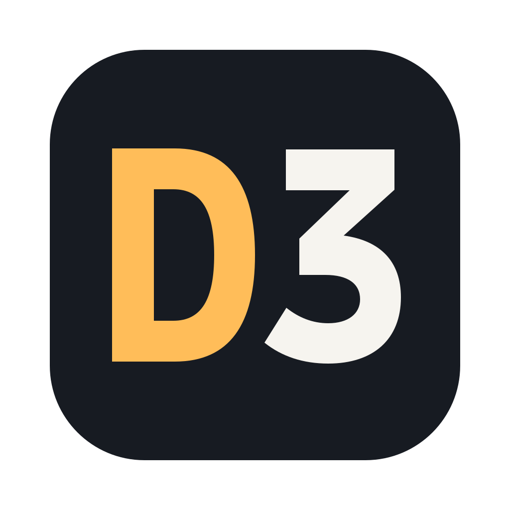

<p align="center">
  
</p>

<h1 align="center">D3 Code (Devis)</h1>

<p align="center">A desktop workspace for coding agents, with Oh My Pi built in as a provider.</p>

<p align="center">
  <a href="https://github.com/Deniskurs/d3code/releases/latest/download/D3-Code-mac-arm64.dmg"><strong>Download for Mac</strong></a>
  &nbsp; · &nbsp;
  <a href="https://github.com/Deniskurs/d3code/releases">Release notes</a>
  &nbsp; · &nbsp;
  <a href="docs/user/install.md">Getting started</a>
</p>

## Your agents, in one workspace

D3 Code brings agent conversations, projects, terminals, and code changes together.
Use Oh My Pi, Codex, Claude Code, Cursor, Grok, OpenCode, or Antigravity with the
accounts and subscriptions supported by each provider.

- **Oh My Pi setup inside the app.** Detect an existing installation, install OMP
  when it is missing, and configure accounts without opening a separate terminal.
- **Projects and conversations.** Keep work organized, review changes, and continue
  conversations across app restarts.
- **Independent releases.** D3 has its own version numbers, icons, application
  identity, and update source.

## Install

The current release supports **Apple Silicon Macs (M1 or newer)**.

1. [Download D3 Code](https://github.com/Deniskurs/d3code/releases/latest/download/D3-Code-mac-arm64.dmg).
2. Open the DMG and drag **D3 Code (Devis)** into Applications.
3. Launch D3 and follow setup to connect your agents and open a project.

The Mac release is signed and notarized by Apple. No App Store installation is
required. Intel Mac, Windows, Linux, and mobile downloads are not currently
published by this project.

## Updates

Future signed D3 releases appear through the app's download and restart controls.
OMP updates have separate provider controls. If you installed an earlier unsigned
D3 build, install the signed release manually once.

The download link above always points to the latest published release.

## Build from source

Install [Vite+](https://viteplus.dev/guide/), then run:

```sh
git clone https://github.com/Deniskurs/d3code.git
cd d3code
vp i
vp run dev
```

Open the pairing URL printed by the development server. For Mac packaging,
run `vp run dist:desktop:dmg:arm64`; local unsigned artifacts appear in `release/`.

Read [CONTRIBUTING.md](CONTRIBUTING.md) before submitting changes.

## License

[MIT](LICENSE). Copyright and third-party notices are retained in the source and
application distribution.
